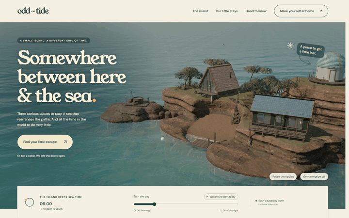
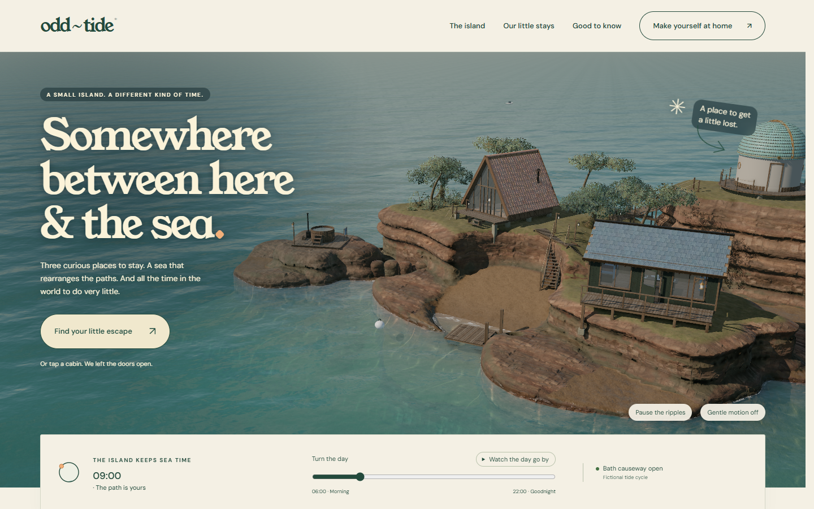
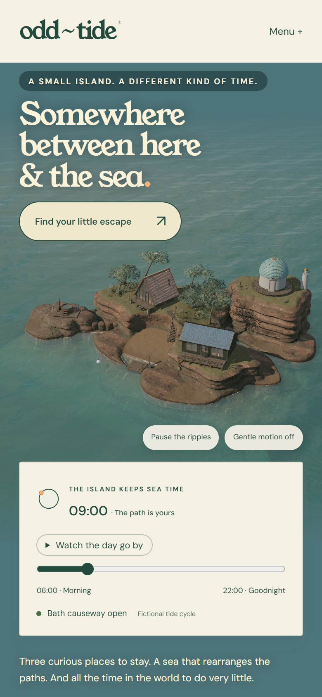

<p align="center"></p>

<p align="center">
  <a href="https://01-odd-tide.williamking.workers.dev"></a>
  
  
  
  
  
  
</p>

**An island that changes its mind twice a day.** Turn the island's time instrument, watch a real route disappear beneath the water, choose a small place to stay and arrange a day that actually works. An experiential 3D website for a fictional coastal stay.

<p align="center"></p>

## What you can do

- **Turn the tide instrument** and watch the causeway and coves flood and drain across the island in real time.
- **Choose a place to stay**, each with its own portrait of the island.
- **Plan a day** around the tide: the planner explains clashes, blocked dates and capacity, then helps you repair them.
- **Share it:** your plan lives in the URL.

## What's inside

- **A hand-built 3D island:** coastal milkwood trees, turf and planting, buildings and mechanisms, a living sea surface and a lighthouse, lit by one physical lighting setup.
- **Honest rules:** calendar, price, availability, tide, scheduling and URL rules live in a pure domain module with unit tests.
- **Choreographed camera moves** with GSAP between the island's viewpoints, and a considered arrival loader.
- **Nine prerendered pages** that read before JavaScript loads, with a real 404.
- **Verified in the browser:** 23 of 23 scripted journeys and a 91-shot breakpoint sweep with no overflow; GPU frame time about 14 ms at 1920×1080 on a desktop RTX 2060.
- **Optional original sound** that only starts on a deliberate press; every task works with sound off.

## Screenshots

| Desktop | Phone |
| --- | --- |
|  |  |

## Built with

Direct Three.js for the island; React for the visitor's choices; GSAP for camera, roof and day choreography; Tailwind CSS with Lightning CSS; TypeScript throughout; Vite and Bun for the build.

- **One lighting model:** a physical sky, sun and haze drive the environment, with GTAO, bloom and SMAA in the post chain.
- **Separation of concerns:** the domain module owns tide and itinerary rules, React owns discrete choices, three.js owns the scene.

## Run it locally

```sh
bun install --frozen-lockfile
bun run dev      # http://127.0.0.1:4511/
bun run check    # strict types, lint, domain tests and the production build
bun run preview  # http://127.0.0.1:4611/
```

Design intent is in [DESIGN.md](DESIGN.md); the working and verification history is in [docs/PROJECT-NOTES.md](docs/PROJECT-NOTES.md).

## Credits

Every sourced texture, model and sound is listed with its source, author and licence in [CREDITS.md](CREDITS.md) and [assets.manifest.json](assets.manifest.json). The stay, prices and bookings are fictional; there is no real booking or payment.

---

<p align="center"><sub>Part of William King's portfolio collection.</sub></p>
