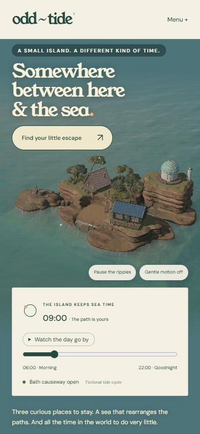
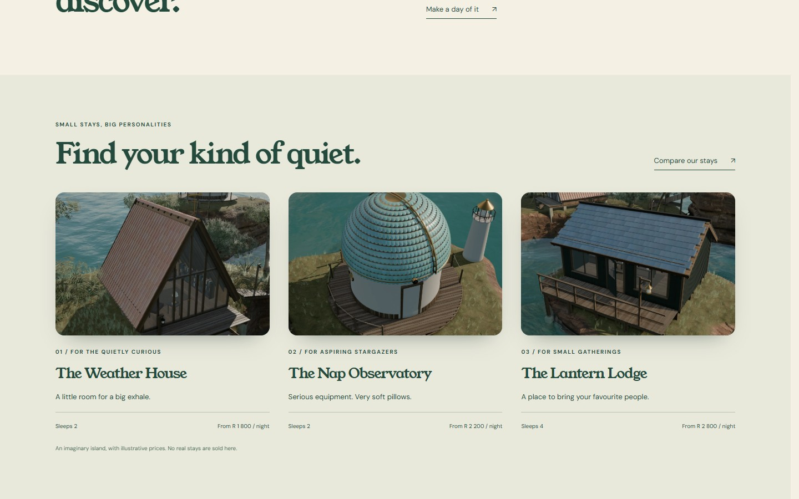

# ODD TIDE

<p align="center"></p>

An island that changes its mind twice a day. Move the tide, watch the causeway disappear, choose a small place to stay and build a day that works around the water. ODD TIDE combines an explorable coastal miniature with a working fictional stay and itinerary planner.

**[Visit the island →](https://01-odd-tide.williamking.workers.dev)** · [Run locally](#run-locally) · [Credits](#credits)

<p align="center"></p>

## Explore the island

- **Move the tide instrument.** The water changes the landscape and the routes available to your itinerary. A flooded crossing is a constraint the planner understands, not just a visual effect.
- **Compare the stays.** Browse the small island properties and their individual pages, choose dates and party size, and see the corresponding availability and price rules.
- **Make a workable day.** Add island activities, inspect timing and capacity conflicts, and repair a plan before taking it to the summary.
- **Keep the result.** Save the plan in this browser, share its URL, print the summary or download a postcard. The URL restores the meaningful choices rather than a screenshot of the interface.
- **Restore the lighthouse.** An optional search for lens pieces at different times of day adds a small island story alongside the planner.

The island, accommodation, prices and availability are fictional. There is no real booking, payment or reservation service.

## Experience and implementation

The continuous Three.js island contains coastal planting, small buildings, a lighthouse and a moving sea. GSAP coordinates camera and architectural transitions with the visitor's choices. React owns the forms and navigation; pure TypeScript owns calendar, pricing, capacity, tide and scheduling decisions.

Nine HTML entry points are prerendered, including stay details, the planner, summary and a real 404. Readable page content is available before the interactive scene starts. Optional sound begins only after a deliberate interaction, and the site offers motion controls and a reduced-motion path.

The current renderer uses GPU-dependent quality tiers, a pixel budget and a frame-time governor. It can shed expensive effects and resolution on slower hardware. Shader warm-up happens behind the arrival screen, and a finite-colour pass protects bloom from invalid pixel values.

## Project map

- [src/domain.ts](src/domain.ts): calendar, pricing, itinerary and URL rules.
- [src/App.tsx](src/App.tsx): routes, forms, saved plans and postcard export.
- [src/World.tsx](src/World.tsx) and [src/world/](src/world/): scene, island structures, materials and render pipeline.
- [tools/prerender.ts](tools/prerender.ts): static route generation.
- [tools/perf/README.md](tools/perf/README.md): optional performance-build workflow.

## Recorded verification

The visual-reset release recorded 23 completed browser journeys and a 91-image breakpoint sweep without overflow. The later performance release is `d52e6b4`. These are recorded release checks, not a new physical-device certification. See [project notes](docs/PROJECT-NOTES.md), [verification](VERIFICATION.md) and [design](DESIGN.md) for scope and history.

## Current screenshots

| Desktop | Phone |
| --- | --- |
|  |  |



The opening loop and three main screenshots were captured from the live site on **1 October 2026**, using Chrome on this workstation; the phone image is a 390 × 844 browser viewport. The animated preview is a short loop, not a full playthrough. [Capture details](docs/readme/capture.json).

## Run locally

Use **Bun 1.3.10** (the version pinned in `package.json`) and Node.js 22.12 or newer. From this repository:

```sh
bun install --frozen-lockfile
bun run dev      # http://127.0.0.1:4511/
bun run check    # strict types, Biome, unit tests and production build
bun run preview  # http://127.0.0.1:4611/ after the build
```

Development and preview are separate long-running commands; run one at a time or use separate terminals. `bun run build` writes the static production output to `dist/`. Dependencies and the lockfile are local to this project.

## Stack and release

Direct Three.js 0.186 · React 19.3 · strict TypeScript · Vite 8.3 · GSAP 3.15 · Tailwind CSS 4.3 · Bun 1.3.10 · Biome. The public website is served by Cloudflare Workers. This README describes [application revision d52e6b4](https://github.com/WilliamHenryKing/01-odd-tide/commit/d52e6b41e80a2b1e88a5a0eaf446c801126fbcc4); the documentation refresh changes no application behaviour.

## Credits

Every sourced texture, model and sound is listed with its source, author and licence in [CREDITS.md](CREDITS.md) and [assets.manifest.json](assets.manifest.json). The stay, prices and bookings are fictional; there is no real booking or payment.

---

Part of [William King's portfolio collection](https://github.com/WilliamHenryKing).
